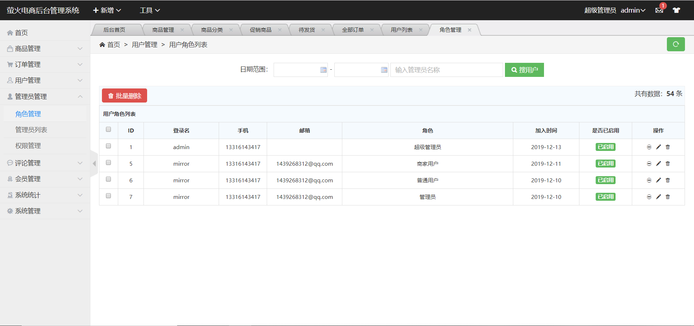

# byyh

# 白云萤火商城微信小程序

## 1项目介绍

- 白云萤火商城微信小程序是一个全品类的电商购物网站（B2C）。
- 用户可以在线购买商品、加入购物车、下单
- 管理员可以在后台管理商品的上下架、促销活动
- 可以评论已购买商品
- 管理员可以监控商品销售状况
- 客服可以在后台处理退款操作

## 2系统架构

### 2.1.系统架构

整个白云萤火商城是一套电商系统可以分为两部分：后台管理系统、前台VX小程序门户系统。

基于S2SH框架整合及相关技术栈开发。

前台商城系统包含首页门户、商品分类、掌上秒杀、首页轮播、商品推荐、商品搜索、商品展示、购物车、订单结算、订单流程、个人订单管理、会员中心、帮助中心等模块。

- 前台门户

   
   
后台管理系统包含用户管理、管理员管理、商品管理、促销商品，评论管理，系统统计，订单管理、分类管理、系统管理，等模块。
  - 后端首页：
    

# 2.技术选型

## 2.1.相关技术

前端技术：

- 基础的HTML、CSS、JavaScript 
- JQuery 
- H-UI

后端技术：

- Struts2  2.x 
- Spring 4.x 
- Hibernnate5.x
- mysql  5.x

## 2.2.开发环境

- IDE：Eclipse Jee 2018-12 版本
- JDK： JDK1.8
- 项目构建：maven3.6.0
- 版本控制工具：git

## 2.3项目截图

### 2.3.1 前台登陆页面

  

### 2.3.2 分类商品页面

  
  
  

### 2.3.3 所有商品页面

  

### 2.3.4 商品详情页面

  

### 2.3.5 购物车页面

  
  
  

### 2.3.6 个人中心页面

  

### 2.3.7 订单状态页面

  

### 2.3.8 后台登陆页面

  

###  2.3.9 商品管理页面

  

### 2.3.10 分类管理页面

  

### 2.3.11 角色管理页面

  
### 2.3.12 用户管理页面

  
